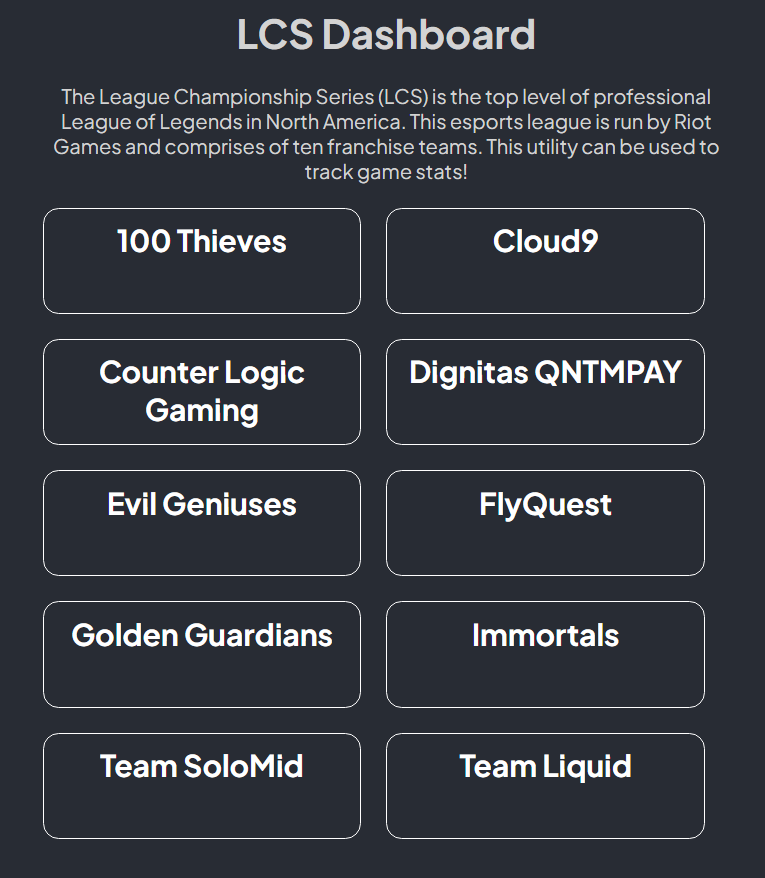
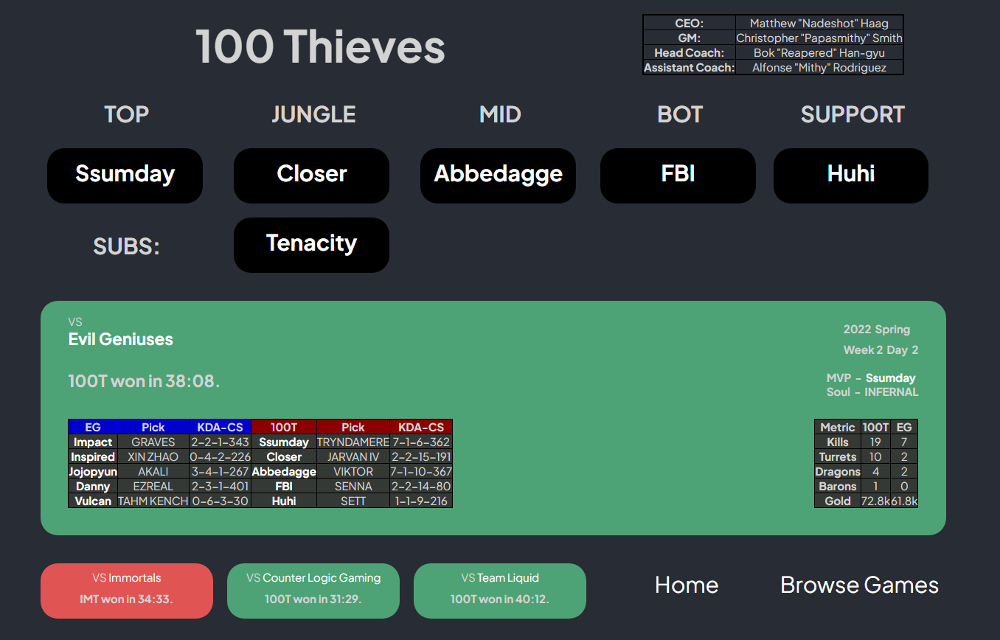
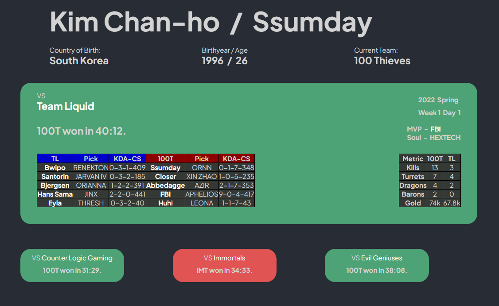
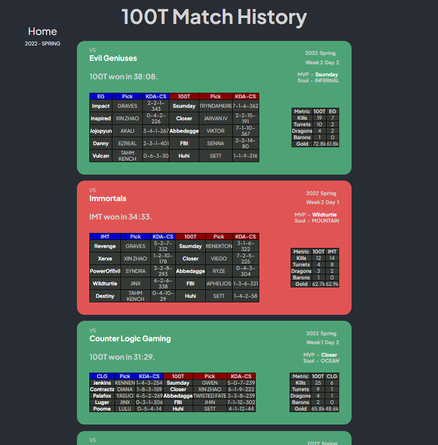
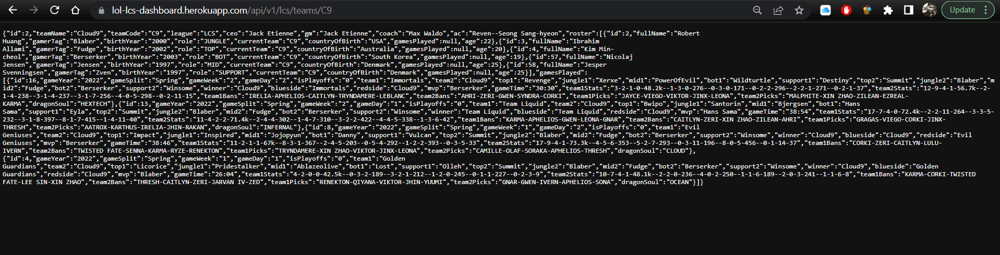
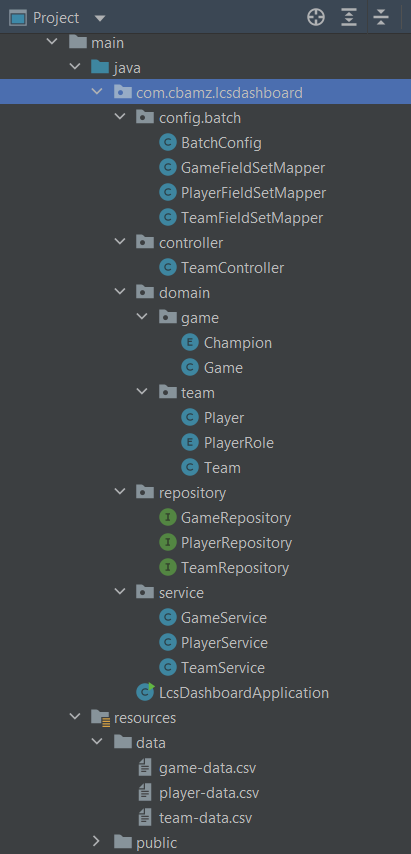
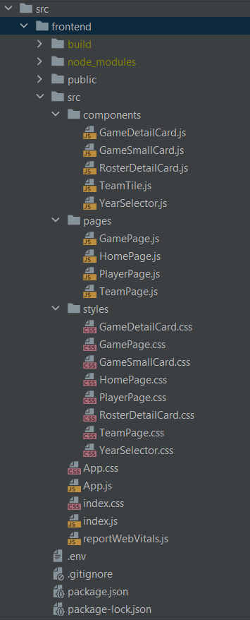

<br />
<div align="center">
  <a href="https://github.com/othneildrew/Best-README-Template">
    
  </a>

  <h3 align="center">LCS Dashboard</h3>

  <p align="center">
    Esports Dashboard to view team details and game history for the League Championship Series (LCS).<br />
    Full-stack application built with SpringBoot and React.
    <br />
    <a href="https://github.com/sibie/lcs-dashboard"><strong>Explore the docs »</strong></a>
    <br />
    <br />
    <a href="https://lol-lcs-dashboard.herokuapp.com/">View Demo</a>
    ·
    <a href="https://github.com/sibie/lcs-dashboard/issues">Report Bug</a>
    ·
    <a href="https://github.com/sibie/lcs-dashboard/issues">Request Feature</a>
  </p>
</div>

## Table of Contents
<details>
  <summary>Click to Expand!</summary>
  <ol>
    <li>
      <a href="#about-the-project">About The Project</a>
      <ul>
        <li><a href="#built-with">Built With</a></li>
      </ul>
    </li>
    <li>
      <a href="#getting-started">Getting Started</a>
      <ul>
        <li><a href="#prerequisites">Prerequisites</a></li>
        <li><a href="#installation">Installation</a></li>
      </ul>
    </li>
    <li><a href="#features">Features</a></li>
    <li><a href="#project-structure">Project Structure</a></li>
    <li><a href="#api-documentation">API Documentation</a></li>
    <li><a href="#csv-datasource">CSV Datasource</a></li>
    <li><a href="#future-improvements">Future Improvements</a></li>
    <li><a href="#acknowledgments">Acknowledgments</a></li>
  </ol>
  </details>

## About The Project

This is an Esports dashboard for the League Championship Series, the top level of professional League of Legends in the US and Canada. The league is run by Riot Games and has ten franchise teams.

As a long-time fan, I thought this would be a fun personal project to work on since this is still a growing space with a lot of scope to build new utilities/services for the fans.

Some features include:

  * Parsing of raw data in the form of CSV files and transforming it into structured data to be stored in a SQL DB.
  * RESTful APIs developed with SpringBoot which can be used to retrieve data from the DB.
  * React frontend for users to browse team data (staff, roster, etc) and check the stats of their latest games.

Aside from the use case itself which interests me, this was a great opportunity to practice full-stack development with separate technology for frontend vs backend.

Feel free to fork your own branch. :grin: Here are some screenshots of the application: <br />

**Home Page** <br />



<br /><br />

**Team Page** <br />



<br /><br />

**Player Page** <br />



<br /><br />

**Game Page** <br />



<br /><br />

**Sample REST API Response** <br />


<br />

**Note** - In case you're wondering why the roster in Team page doesn't match the players being shown in games, its because player data is up to date taking into account the latest roster moves that happened over the past month. However since I didn't want to spend too much time preparing game data as this is a PoC, I limited it to the first 20 games of the 2022 spring split. Obviously some of those players have swapped teams since then.

<p align="right">(<a href="#top">back to top</a>)</p>


### Built With

* [**Java**](https://www.java.com/en/) - Programming language of my choice.
* [**Maven**](https://maven.apache.org/) - Build tool for the project.
* [**SpringBoot**](https://spring.io/projects/spring-boot) - Has everything you need to build out amazing cloud-native web applications.
  * *Spring Data JPA* - Auto creation of DB tables and easy mapping to entites and CRUD repositories.
  * *Spring Batch* - For parsing raw data from CSV files and loading each record into DB tables created by JPA.
  * *Spring MVC* - To develop RESTful web services that map backend application logic to URLs to be consumed by frontend.
  * *H2* - Since this is a personal project, using H2 embedded DB just makes things easier for deployment to Heroku.
  * *Lombok* - Provides annotations which can be used to reduce boilerplate code for model/data objects.
* [**React**](https://reactjs.org/) - Popular frontend JS library for developing user interfaces based on UI components.
  * *React Hooks* - Used hooks like useState and useParams to construct and make API calls to the backend.
  * *React Router* - For mapping the different routes to pages in the frontend application.
  * *CSS* - I would have preferred to use Bootstrap, but just wrote my own CSS in the interest of time.

<p align="right">(<a href="#top">back to top</a>)</p>


## Getting Started

### Prerequisites

1. Java 1.8 or above installed on your local system - Spring dependencies will most likely not work with anything pre-8.
2. Node >= 14.0.0 and npm >= 5.6. If you are new to React, you'll have to use npm to install `react` and `react-router-dom`.
3. Any IDE and Build tool of your choice. You have two approaches here:
   - VSCode is the best editor for coding with React. You can install plugins for Java/Spring/Maven support and work with the frontend and backend together.
   - My preferred style of using a legit IDE like IntelliJ with Maven for the backend, and swap to VSCode to work with React.

### Installation

1. Once you have your local environment set up, simply clone this repo from GitHub:
   ```sh
   git clone https://github.com/sibie/lcs-dashboard.git
   ```
2. Configure the application.yml file with DB details you wish to use. You'll need different info in here and `pom.xml` if you want to work with something other than H2.
   ```yml
   spring:
    datasource:
    url:
    username:
    password:
    driverClassName: org.h2.Driver
    console.enabled: true
   ```

3. Do a quick check to make sure raw CSV files are available in `src/main/resources/data` directory. There are 3 files here:
   - `team-data.csv` - contains info on the 10 franchise teams in the LCS.
   - `player-data.csv` - contains info on the players currently participating in the LCS and some Free Agents.
   - `game-data.csv` - contains info for the first 20 games of the 2022 Spring Split (limited the dataset since this is a PoC). You can add more data if you like, just follow the same format.
   
   **Note** - If you want to tweak the columns or how the data is organized, application will fail unless you reconcile the mappers and Batch Config with your changes.
   
3. If you have Maven configured with your IDE, the build process should start automatically. For command line prompt you can use:
   ```sh
   mvn install
   ```
 
4. Run the main application class and you should see it up and running on localhost:8080.
   
5. For local development of frontend with live dev server, `REACT_APP_API_ROOT_URL` field in React .env file has to be set to `http://localhost:3000`. Then you can use`npm start` and edit the code.

6. In case you want to run frontend and backend together:
   - Set `REACT_APP_API_ROOT_URL` as `http://localhost:8080` or whatever port you are using for SpringBoot.
   - Navigate to `src/frontend` in terminal and run the command `npm run-script build` to create React resources in `src/main/resources/public` directory so SpringBoot uses React as the root.
   - If process completed successfully, you should see assets in the public directory. Go ahead and run the SpringBoot application class and you should see the React page at your root URL.

***Note** - This project was developed with Java 17, I just made the POM version as 8 so I could deploy my app with my free Heroku account.*

<p align="right">(<a href="#top">back to top</a>)</p>


## Features

* **RESTful Web Services powered by Java and SpringBoot**
  
  * Entity modeling for teams, players and games, using Spring JPA to auto-create tables and dynamic queries in H2.
  * Used Spring Batch to read raw data from CSV files and add each record to the application DB.
  * Spring MVC used to create RESTful APIs to retrieve different datasets from backend for frontend rendering.

* **Dashboard UI developed with React for users to interact with APIs and view data of different teams/players**
  
  **User experience**: 
  * Home page with a short intro and listing of all 10 franchise teams that users can browse data for.
  * Team page with key information like staff details, current roster/subs and the past 4 games played.
  * Game page with the full details of all games played by the specified team in the latest split. Displays list of other splits for which data is available so users can navigate through the data.
  * Player page with his personal information and the latest games he participated in.
  * Designed custom React components for displaying data about a single game - one has all details such as player scores, team metrics, MVP, etc, while the other is smaller and just mentions the result.
  
  **Packages/Utilities used**
  * Used React Router to set up navigation paths to each of the different pages available in the React app.
  * Utilized React hooks like useState for making API calls to SpringBoot to GET requested data and useParams for constructing the request bodies.
  * Every Team or Player label is clickable and will re-render page with that entity's data. This is done using Link.
  * Wrote my own CSS to style each of the different components and pages.

<p align="right">(<a href="#top">back to top</a>)</p>


## Project Structure

**Backend (Java/SpringBoot)** <br />



<br /><br />

**Frontend (React)** <br />



<br />

**Note** - If you browse the code, you'll find that the React app was created in `frontend` directory which is in SpringBoot `src` directory. This is an intentional design decision since I wanted everything to be packaged as a single application.

## API Documentation

TBC

## CSV Datasource

TBC


## Future Improvements

**Improvements to the Raw Data**
* Since this is a PoC, I opted to limit Game data to the first 20 games of the 2022 Spring Split. This was done to save time since I prepared the CSV files myself.
* However, a better approach for a production-grade application would be to use the services of an Esports data provider like Oracle's Elixir as they have huge streams of historical data that you can download as excel files from their website. We could convert these into CSVs and enhance the existing entities, mappers and Batch config to capture all this information and make it available as part of API calls. Then we can update our frontend to make this dashboard a truly powerful tool.
* Alternatively, Riot provides internal API access on a case-by-case basis to individuals/orgs who are looking to build something meaningful around the game. Probably the best direction to take if you want product credibility within the community. <br />

**Advanced Player/Team Metrics**
* Esports analytics has developed a ton throughout the years with its rise in popularity. Instead of simply displaying each bit of data we read from raw source, we could prepare additional meaningful metrics from that data which capture the performance of different teams/players across a game or time period. This information would greatly enhance the value from using this dashboard. 
* A custom stat generator tool would be really useful too. Users could create their own metrics from raw data returned from API and then export their findings into a csv/excel file they can download and review later.
* Additionally, it would be a cool feature to create a Comparision page component, that allows you to review 2 or more team/player stats against each other and compare their performances. <br />

**Player/Team Images**
Goes without saying, but team logos and player images would help improve the browsing experience as well. I toyed with the idea of picking up some images from fandom files and using them (either by URL or saving the image itself as a resource in app), but I was unsure of copyright issues so passed on that. Would be nice to add this in the future. We could also add some custom stylings for teams/players who have noteworthy achievements that should be highlighted.<br />

**Page and Component Styling**
If there's ever a point where you feel that you are 100% done with your UI, then your approach is wrong. Developing your UI is a continuous process and you should always be looking for ways to improve the user experience based on feedback. I like the way the styling turned out considering the time I put into it, but the CSS could definitely be tweaked, or even enhanced with Bootstrap. There's a lot of cool resources out there which you can use to create more dynamic tables and pages so that would be an interesting area to research further on.

**Choice of DB / Deployment & Hosting**
* H2 is never a good idea for production-grade applications. Considering the volume of data we could potentially have, shifting to a more powerful DB like HSQL, PostreSQL or even Mongo could be a better choice. Obviously that would require some changes to our configuration and deployment process. 
* I also opted for Heroku just because I wanted to get this up on the web at the soonest. But considering the number of users who could be concurrently accessing this, the infra for deployment would need to be re-evaluated. AWS or another premium solution would be better so it is easier to scale as demand for resources increase.

<p align="right">(<a href="#top">back to top</a>)</p>


## Acknowledgments

* [**Java Brains**](https://www.youtube.com/c/JavaBrainsChannel) - Came across a great video series for developing a Cricket dashboard, which inspired me to work on this project.
* [**React Community**](https://dev.to/t/react)
* [**Spring Community**](https://spring.io/community)

Also it goes without saying, but a huge thanks to the amazing community on Stack Overflow for the hundreds of doubts I've clarified there. :grin:

<p align="right">(<a href="#top">back to top</a>)</p>
